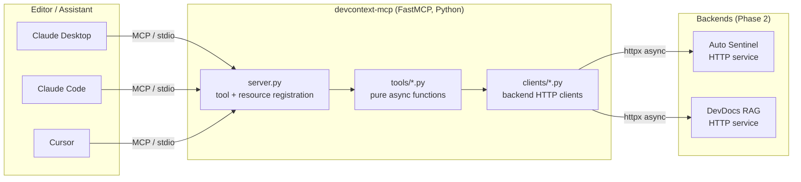
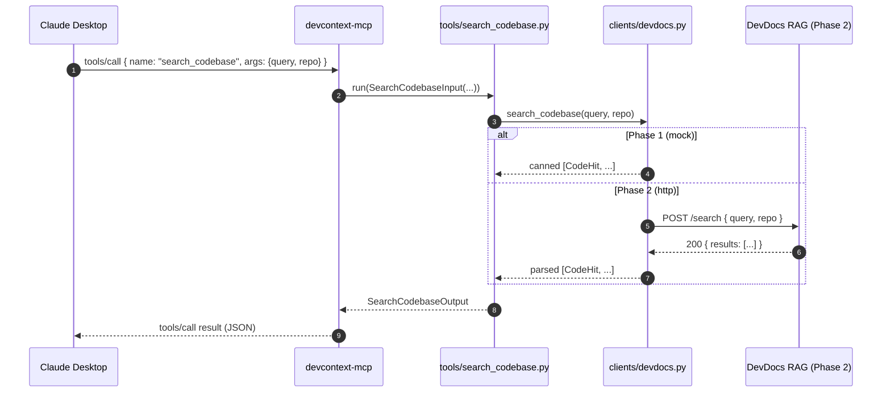

# Architecture

This document describes how a single MCP call flows from an editor client to
a backend service through `devcontext-mcp`.

## High-level



## Sequence: a `search_codebase` call



## Layering rules

| Layer       | Knows about                              | Does not know about               |
|-------------|------------------------------------------|-----------------------------------|
| `server.py` | tools, clients, MCP SDK                  | HTTP wire format                  |
| `tools/*`   | clients, Pydantic models                 | MCP SDK, transport                |
| `clients/*` | httpx, backend wire format               | tools, MCP SDK                    |

This separation lets us:

- Unit-test tools with a fake client (no MCP runtime needed).
- Swap mock clients for real HTTP without touching tool signatures.
- Swap stdio for HTTP/SSE transport in Phase 3 without touching tools or clients.

## Why FastMCP

`FastMCP` (the high-level wrapper in the `mcp` SDK) auto-derives JSON Schema
from typed Python signatures. We pair it with explicit Pydantic models inside
each tool because:

1. We want the **input/output contract** to be testable independently of the
   server, and reusable for OpenAPI generation in Phase 2.
2. We want **strict validation** (`min_length`, regex, enum) at the boundary,
   not relying on the LLM to send well-formed JSON.

## Configuration flow

```
.env  ──▶  pydantic-settings (config.py)  ──▶  build_server(settings)
                                                  │
                                                  ▼
                                          AutoSentinelClient(url, mock=...)
                                          DevDocsClient(url, mock=...)
```

`backend_mode=mock` (Phase 1) makes the client classes return canned data.
`backend_mode=http` (Phase 2) will route through real `httpx.AsyncClient` calls.
